# audio-filter

Named audio filters for JavaScript — [weighting](#weighting), [auditory](#auditory), [analog](#analog), [speech](#speech), [eq](#eq), [effect](#effect).

```
npm install audio-filter
```


## What are audio filters?

General filter design ([digital-filter](https://github.com/audiojs/digital-filter)) asks: *given a specification — passband, stopband, ripple — what coefficients produce it?* Audio filters are different: they are named, historically grounded, each with a designer, a standard, or a circuit. A Butterworth is a mathematical abstraction; a Moog ladder is a specific physical circuit from 1965. A-weighting is an IEC standard with five decimal places of precision. These are the filters audio engineers recognize by name.

This package collects canonical implementations of those filters, organized into six domains.


## Install

```js
import * as af from 'audio-filter'                  // everything
import { aWeighting, kWeighting } from 'audio-filter/weighting'
import { gammatone, barkBank } from 'audio-filter/auditory'
import { moogLadder, korg35 } from 'audio-filter/analog'
import { formant, vocoder } from 'audio-filter/speech'
import { graphicEq, crossover } from 'audio-filter/eq'
import { dcBlocker, resonator } from 'audio-filter/effect'
```


## API

Two shapes. Pick based on what you need back.

### SOS filters — return coefficients

```js
let sos = aWeighting(44100)   // → [{b0, b1, b2, a1, a2}, ...]
```

These return an array of biquad sections (SOS). Use with `digital-filter`'s analysis and processing tools:

```js
import { freqz, mag2db, filter } from 'digital-filter'

let sos  = aWeighting(44100)
let resp = freqz(sos, 2048, 44100)      // frequency response
let db   = mag2db(resp.magnitude)       // to dB
filter(buffer, { coefs: sos })          // apply to audio
```

Filters in this shape: all [weighting](#weighting) and [crossover](#crossover).

### Processing filters — mutate buffer in-place

```js
moogLadder(buffer, { fc: 1000, resonance: 0.5, fs: 44100 })
```

These take a `Float32Array` or `Float64Array` and modify it in-place. State is stored in the params object under `_`-prefixed keys — pass the same object on every call.

```js
// Block processing — state persists automatically across buffers
let params = { fc: 1000, resonance: 0.5, fs: 44100 }
for (let buf of stream) moogLadder(buf, params)
```

All [auditory](#auditory), [analog](#analog), [speech](#speech), and [effect](#effect) filters use this shape. Some [eq](#eq) filters too.


## Weighting

Standard measurement curves. Each is defined by a standards body to a specific curve shape and normalization. All return SOS coefficients.

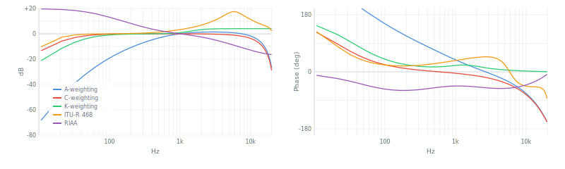

| filter | standard | normalized | sections |
|---|---|---|---|
| `aWeighting` | IEC 61672-1:2013 | 0 dB at 1 kHz | 3 SOS |
| `cWeighting` | IEC 61672-1:2013 | 0 dB at 1 kHz | 2 SOS |
| `kWeighting` | ITU-R BS.1770-4:2015 | — | 2 SOS |
| `itu468` | ITU-R BS.468-4:1986 | +12.2 dB at 6.3 kHz | 4 SOS |
| `riaa` | RIAA 1954 / IEC 60098 | 0 dB at 1 kHz | 1 SOS |


### A-weighting

*Models how the ear perceives loudness — attenuates low and very high frequencies.*

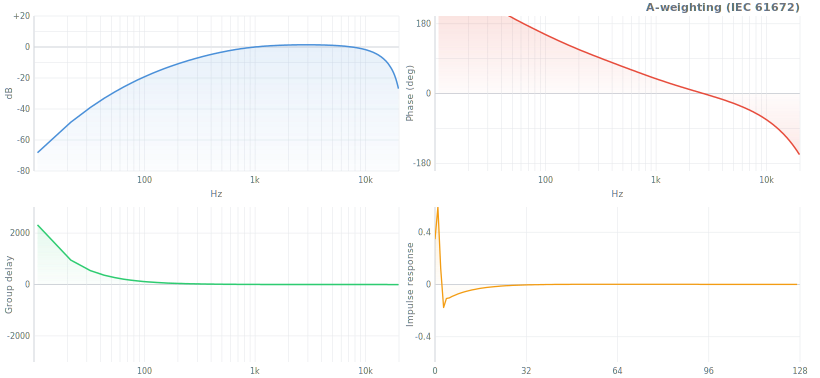

| param | default | description |
|---|---|---|
| `fs` | 44100 | sample rate |

```js
import { aWeighting } from 'audio-filter/weighting'
import { freqz, mag2db } from 'digital-filter'

let sos  = aWeighting(44100)
let resp = freqz(sos, 2048, 44100)
let db   = mag2db(resp.magnitude)   // A-weighted spectrum
```

<details>
<summary>Reference</summary>

**Standard**: IEC 61672-1:2013 (supersedes IEC 651:1979)
**Transfer function**: H(s) = K·s⁴ / ((s+ω₁)²·(s+ω₂)·(s+ω₃)·(s+ω₄)²)
**Poles**: ω₁=2π·20.6 Hz, ω₂=2π·107.7 Hz, ω₃=2π·737.9 Hz, ω₄=2π·12194 Hz
**Implementation**: bilinear transform of analog prototype, prewarped poles, 3 SOS sections
**Normalization**: 0 dB at 1 kHz (IEC requirement)
**Use when**: measuring SPL, noise, OSHA compliance, audio quality
**Not for**: loudness in broadcast (use K-weighting), noise annoyance (use ITU-468)

</details>


### C-weighting

*Like A-weighting but flatter — less rolloff at low and high frequencies.*

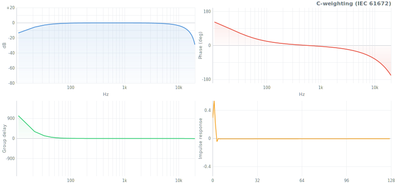

| param | default | description |
|---|---|---|
| `fs` | 44100 | sample rate |

```js
let sos = cWeighting(44100)
```

<details>
<summary>Reference</summary>

**Standard**: IEC 61672-1:2013
**Transfer function**: H(s) = K·s² / ((s+ω₁)²·(s+ω₄)²)
**Poles**: ω₁=2π·20.6 Hz, ω₄=2π·12194 Hz (same as A-weighting outer poles)
**Implementation**: 2 SOS sections, bilinear transform
**Use when**: peak sound level measurement, where A-weighting over-penalizes bass
**Compared to A**: rolls off below 31.5 Hz and above 8 kHz; flat 31.5 Hz–8 kHz

</details>


### K-weighting

*The loudness measurement curve — a high shelf plus a highpass. Used to compute LUFS.*

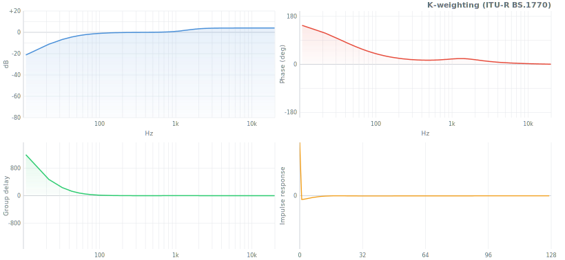

| param | default | description |
|---|---|---|
| `fs` | 48000 | sample rate (48000 returns exact spec coefficients) |

```js
import { kWeighting } from 'audio-filter/weighting'

let sos = kWeighting(48000)   // exact ITU-R BS.1770 coefficients
let sos = kWeighting(44100)   // approximated via biquad design
```

<details>
<summary>Reference</summary>

**Standard**: ITU-R BS.1770-4:2015, EBU R128, AES TD1004.1.15-10
**Stage 1**: pre-filter — high shelf +4 dB above ~1.5 kHz (head diffraction simulation)
**Stage 2**: RLB highpass — 2nd-order Butterworth at ~38 Hz (removes sub-bass)
**Exact coefficients at 48 kHz**: specified in BS.1770 Annex 1; this implementation uses them verbatim
**Use when**: computing integrated loudness (LUFS/LKFS), broadcast loudness normalization
**Not for**: A-weighted SPL measurement (different shape, different standard)

</details>


### ITU-R 468

*Peaked noise weighting — peaks at +12.2 dB near 6.3 kHz — models how humans actually perceive noise annoyance.*

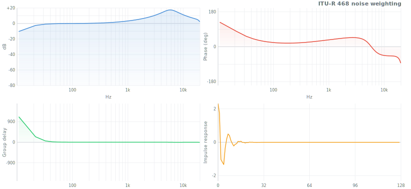

| param | default | description |
|---|---|---|
| `fs` | 48000 | sample rate |

```js
let sos = itu468(48000)
```

<details>
<summary>Reference</summary>

**Standard**: ITU-R BS.468-4:1986 (original CCIR 468, 1968)
**Shape**: rises steeply from 31.5 Hz, peaks at +12.2 dB at 6.3 kHz, rolls off above 10 kHz
**Rationale**: human hearing is more sensitive to short noise bursts than sine tones; 468 weights accordingly
**Implementation**: practical IIR approximation via cascaded biquads, within ~1 dB of spec
**Use when**: measuring noise in broadcast equipment, tape noise, hum and hiss
**Compared to A-weighting**: 6.3 kHz peak makes it harsher on hiss; preferred in European broadcast

</details>


### RIAA

*Playback equalization for vinyl records — a shelving curve with three time constants.*

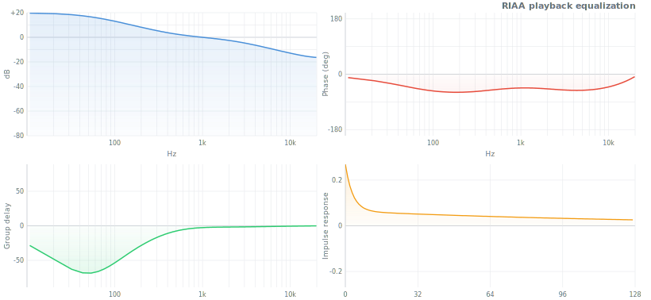

| param | default | description |
|---|---|---|
| `fs` | 44100 | sample rate |

```js
import { riaa } from 'audio-filter/weighting'
import { filter } from 'digital-filter'

let sos = riaa(44100)
filter(phonoSignal, { coefs: sos })   // correct vinyl playback
```

<details>
<summary>Reference</summary>

**Standard**: RIAA 1954, codified IEC 60098:1987
**Time constants**: T₁=3180 μs (50.05 Hz pole), T₂=318 μs (500.5 Hz zero), T₃=75 μs (2122 Hz pole)
**Transfer function**: H(s) = (1 + s·T₂) / ((1 + s·T₁)(1 + s·T₃))
**Purpose**: playback de-emphasis undoes the mastering pre-emphasis applied during vinyl cutting
**Shape**: boosts bass ~+20 dB at 20 Hz, rolls off treble; at playback restores flat response
**Implementation**: 1 SOS section via bilinear transform, normalized 0 dB at 1 kHz

</details>


## Auditory

Models of the human auditory system — how the cochlea and brain decompose sound into frequency channels. Used in psychoacoustics, music information retrieval, and hearing aid design.


### Gammatone

*The cochlear filter — bandpass tuned to one frequency, decaying oscillation, mimics an inner hair cell.*

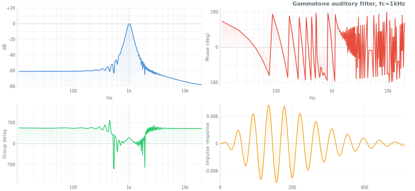

| param | default | description |
|---|---|---|
| `fc` | 1000 | center frequency (Hz) |
| `fs` | 44100 | sample rate |
| `order` | 4 | filter order (1–8) |

```js
import { gammatone } from 'audio-filter/auditory'

let params = { fc: 1000, fs: 44100 }
gammatone(buffer, params)   // bandpass at 1 kHz with cochlear envelope
```

Reuse `params` across blocks — state in `params._s`, gain cached in `params._gain`.

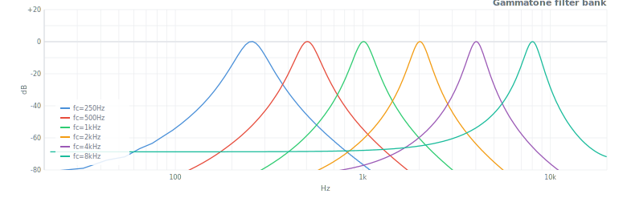

<details>
<summary>Reference</summary>

**Origin**: Patterson, Robinson, Holdsworth, McKeown, Zhang & Allerhand (1992), "Complex sounds and auditory images"
**Model**: cascade of complex one-pole filters; 4th-order is the standard cochlear approximation
**Bandwidth**: ERB = 24.7·(4.37·fc/1000 + 1) Hz
**Implementation**: complex resonator with gain normalization to 0 dB at fc
**Use when**: cochlear modeling, auditory scene analysis, psychoacoustic feature extraction
**Compared to Butterworth bandpass**: gammatone has asymmetric temporal envelope matching biological data

</details>


### Octave bank

*ISO/IEC fractional-octave filter bank — the standard for acoustic measurement and spectrum analysis.*

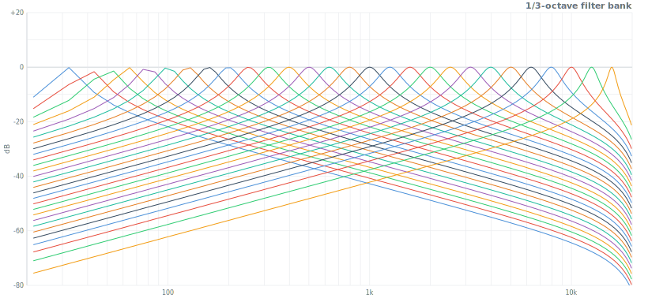

| param | default | description |
|---|---|---|
| `fraction` | 3 | octave fraction (1, 3, 6, 12, ...) |
| `fs` | 44100 | sample rate |
| `opts.fmin` | 31.25 | lowest center frequency (Hz) |
| `opts.fmax` | 16000 | highest center frequency (Hz) |

**Returns** array of `{ fc, coefs }` — each band is a biquad bandpass section.

```js
import { octaveBank } from 'audio-filter/auditory'
import { filter } from 'digital-filter'

let bands = octaveBank(3, 44100)   // 1/3-octave, 30+ bands
for (let band of bands) {
  let buf = Float64Array.from(signal)
  filter(buf, { coefs: band.coefs })
  spectrum.push({ fc: band.fc, energy: rms(buf) })
}
```

<details>
<summary>Reference</summary>

**Standard**: IEC 61260-1:2014, ANSI S1.11:2004
**Center frequencies**: ISO 266 series — fc = 1000·G^(k/fraction), G = 10^(3/10)
**Bandwidth**: each band spans fc·G^(−1/2n) to fc·G^(+1/2n)
**1/1 octave**: 10 bands (31.5–16 kHz) — coarse; **1/3 octave**: 30 bands — standard; **1/6+**: psychoacoustics
**Use when**: acoustic measurement, noise assessment, spectrum visualization

</details>


### ERB bank

*Equivalent Rectangular Bandwidth scale — how the auditory system actually spaces its channels.*

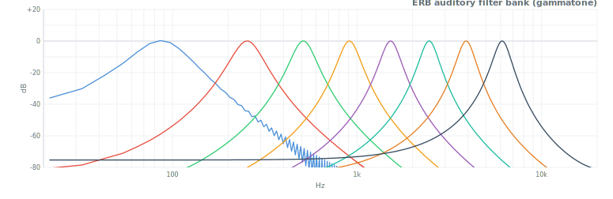

| param | default | description |
|---|---|---|
| `fs` | 44100 | sample rate |
| `opts.fmin` | 50 | lowest center frequency (Hz) |
| `opts.fmax` | 8000 | highest center frequency (Hz) |
| `opts.nBands` | auto | number of bands |

**Returns** array of `{ fc, erb, bw }` descriptors. Apply `gammatone` at each `fc` for the filter bank.

```js
import { erbBank, gammatone } from 'audio-filter/auditory'

let bands  = erbBank(44100)
let states = bands.map(b => ({ fc: b.fc, fs: 44100 }))

for (let buf of stream) {
  let channels = bands.map((_, i) => {
    let b = Float64Array.from(buf)
    gammatone(b, states[i])
    return b
  })
}
```

<details>
<summary>Reference</summary>

**Origin**: Moore & Glasberg (1983, 1990), "Suggested formulae for calculating auditory filter bandwidths"
**ERB formula**: ERB(fc) = 24.7·(4.37·fc/1000 + 1)
**Spacing**: ~1 ERB between adjacent channels — logarithmic above 1 kHz, more linear below
**Use when**: speech processing, hearing models, auditory feature extraction
**Compared to Bark**: ERB is more accurate above 500 Hz; Bark is the psychoacoustic masking model

</details>


### Bark bank

*Zwicker's 24 critical bands — the psychoacoustic foundation of perceptual audio coding.*

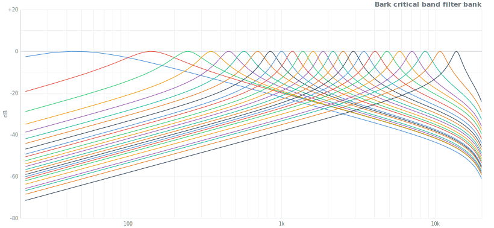

| param | default | description |
|---|---|---|
| `fs` | 44100 | sample rate |

**Returns** array of `{ bark, fLow, fHigh, fc, coefs }` — each band is a biquad bandpass section.

```js
import { barkBank } from 'audio-filter/auditory'
import { filter } from 'digital-filter'

let bands = barkBank(44100)   // 24 critical bands
for (let band of bands) {
  let buf = Float64Array.from(signal)
  filter(buf, { coefs: band.coefs })
  excitation[band.bark] = rms(buf)
}
```

<details>
<summary>Reference</summary>

**Origin**: Eberhard Zwicker (1961), "Subdivision of the audible frequency range into critical bands"
**Scale**: 24 bands spanning 20 Hz–20 kHz; named after Heinrich Barkhausen
**Band widths**: ~100 Hz wide below 500 Hz; ~20% of center frequency above
**Use when**: perceptual audio coding (MP3/AAC use Bark-like groupings), loudness models, masking
**Compared to ERB**: Bark bands are wider and fewer; ERB is more accurate for hearing science

</details>


## Analog

Discrete-time models of analog circuits — each named after the hardware it replicates. Nonlinear, stateful, process in-place. The filters in synthesizers.


### Moog ladder

*Robert Moog's 4-pole transistor ladder, 1965 — the most imitated filter in electronic music.*

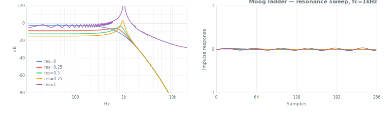

| param | default | description |
|---|---|---|
| `fc` | 1000 | cutoff frequency (Hz) |
| `resonance` | 0 | resonance 0–1 (self-oscillates at 1) |
| `drive` | 1 | input drive — amount of tanh saturation |
| `fs` | 44100 | sample rate |

```js
import { moogLadder } from 'audio-filter/analog'

let params = { fc: 800, resonance: 0.7, fs: 44100 }
moogLadder(buffer, params)

// Self-oscillation — runs indefinitely from a single impulse
let silent = new Float64Array(4096); silent[0] = 0.01
moogLadder(silent, { fc: 1000, resonance: 1, fs: 44100 })
```

<details>
<summary>Reference</summary>

**Designer**: Robert Moog, 1965. Patent US3475623.
**Circuit**: 4 cascaded one-pole transistor ladder sections, global feedback from output to input
**Implementation**: Zero-delay feedback (ZDF) via trapezoidal integration — no unit delay in feedback path
**Reference**: Zavalishin (2012), "The Art of VA Filter Design", Ch. 6; Välimäki & Smith (2006)
**Response**: −24 dB/octave lowpass; resonance peak at fc; self-oscillation (sine wave) at resonance=1
**Nonlinearity**: tanh saturation at input (transistor ladder characteristic)
**vs Diode ladder**: Moog saturates only at input; diode saturates at each stage — different character at high resonance

</details>


### Diode ladder

*Roland TB-303 / EMS VCS3 style — per-stage saturation gives the characteristic acid "squelch".*

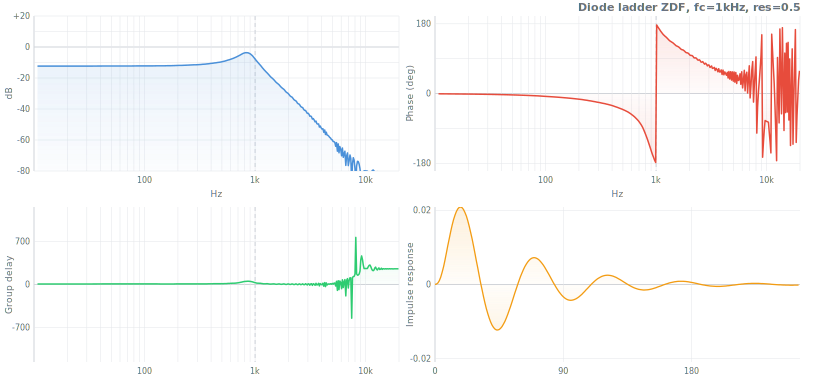

| param | default | description |
|---|---|---|
| `fc` | 1000 | cutoff frequency (Hz) |
| `resonance` | 0 | resonance 0–1 |
| `fs` | 44100 | sample rate |

```js
import { diodeLadder } from 'audio-filter/analog'

let params = { fc: 500, resonance: 0.8, fs: 44100 }
diodeLadder(buffer, params)
```

<details>
<summary>Reference</summary>

**Circuit**: Roland TB-303, EMS VCS3, EDP Wasp, and others
**Key difference from Moog**: tanh nonlinearity at each of 4 stages, not just input; feedback is a weighted sum of all stage outputs
**Character**: preserves bass at high resonance; more "squelchy" and aggressive than Moog
**Implementation**: ZDF, Zavalishin (2012); Pirkle (2019), "Designing Audio Effect Plugins in C++", Ch. 10
**Stability**: stable up to resonance=0.95; bounded output

</details>


### Korg35

*Korg MS-10/MS-20, 1978 — 2-pole filter with lowpass and complementary highpass outputs.*

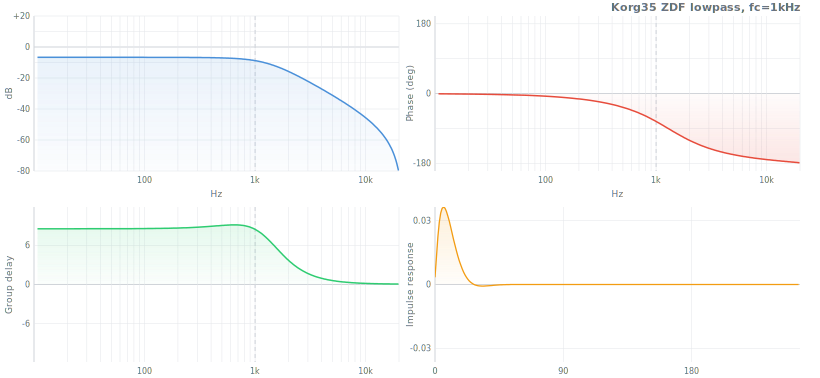 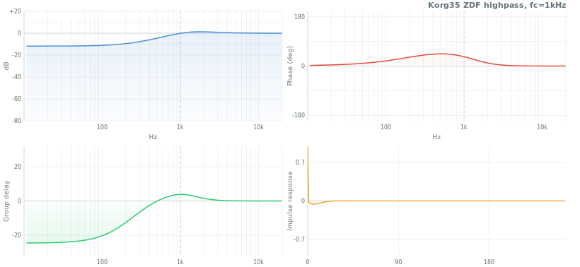

| param | default | description |
|---|---|---|
| `fc` | 1000 | cutoff frequency (Hz) |
| `resonance` | 0 | resonance 0–1 |
| `type` | `'lowpass'` | `'lowpass'` or `'highpass'` |
| `fs` | 44100 | sample rate |

```js
import { korg35 } from 'audio-filter/analog'

korg35(buffer, { fc: 1000, resonance: 0.5, type: 'lowpass',  fs: 44100 })
korg35(buffer, { fc: 1000, resonance: 0.5, type: 'highpass', fs: 44100 })
```

<details>
<summary>Reference</summary>

**Circuit**: Korg MS-10 (1978), MS-20 (1978)
**Topology**: 2 cascaded one-pole sections with nonlinear feedback; HP = input − LP
**Analysis**: Stilson & Smith (1996), "Analyzing the Korg MS-20 Filter"; Zavalishin (2012), Ch. 5
**Character**: −12 dB/octave; aggressive resonance due to nonlinear feedback; both LP and HP from one circuit
**vs Moog ladder**: 2-pole (−12 dB/oct) vs 4-pole (−24 dB/oct); Korg35 has complementary HP mode

</details>


## Speech

Filters that model or process the human vocal tract — from vowel synthesis to spectral voice coding.


### Formant

*Parallel resonator bank — each peak models one vocal tract resonance (formant).*

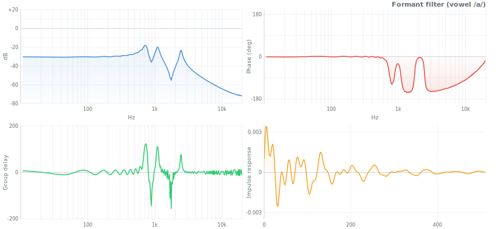

| param | default | description |
|---|---|---|
| `formants` | vowel /a/ | array of `{ fc, bw, gain }` |
| `fs` | 44100 | sample rate |

Defaults: F1=730 Hz, F2=1090 Hz, F3=2440 Hz (open vowel /a/).

```js
import { formant } from 'audio-filter/speech'

formant(excitation, { fs: 44100 })   // vowel /a/ (default)

formant(excitation, {
  formants: [{ fc: 270, bw: 60, gain: 1 }, { fc: 2290, bw: 90, gain: 0.5 }],
  fs: 44100
})   // vowel /i/
```

<details>
<summary>Reference</summary>

**Model**: parallel combination of second-order resonators, each modeling one vocal tract mode
**Formant frequencies**: determined by vocal tract shape; F1 controls vowel openness, F2 controls front/back
**Typical ranges**: F1: 250–850 Hz, F2: 850–2500 Hz, F3: 1700–3500 Hz
**Implementation**: uses `resonator` internally — constant peak-gain bandpass per formant
**Use when**: speech synthesis, singing synthesis, vocal effects, acoustic phonetics
**Not a substitute for**: LPC synthesis, which estimates formants automatically from a speech signal

</details>


### Vocoder

*Channel vocoder — transfers the spectral envelope of one sound onto the pitched content of another.*

| param | default | description |
|---|---|---|
| `bands` | 16 | number of frequency bands |
| `fmin` | 100 | lowest band center (Hz) |
| `fmax` | 8000 | highest band center (Hz) |
| `fs` | 44100 | sample rate |

Note: takes two separate buffers, returns a new buffer (does not modify in-place).

```js
import { vocoder } from 'audio-filter/speech'

// carrier: pitched source (sawtooth, buzz, noise...)
// modulator: signal whose spectral shape to impose (voice, instrument...)
let output = vocoder(carrier, modulator, { bands: 16, fs: 44100 })
```

<details>
<summary>Reference</summary>

**Inventor**: Homer Dudley, Bell Labs, 1939. US Patent 2151091.
**Principle**: analyze modulator into N bands → extract envelope per band → multiply with filtered carrier → sum
**Implementation**: N parallel bandpass filters on both signals; envelope follower per modulator band
**Band count**: 8 = robotic effect; 16 = classic vocoder sound; 32+ = more speech intelligibility
**Use when**: voice effects, talkbox simulation, cross-synthesis, spectral morphing

</details>


## EQ

Equalization and frequency routing — from parametric studio EQ to speaker crossover networks.


### Graphic EQ

*10-band ISO octave equalizer — fixed center frequencies, gain per band.*

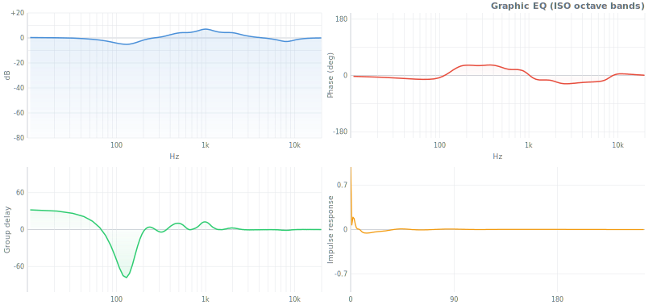

| param | default | description |
|---|---|---|
| `gains` | `{}` | `{ fc: dB }` — only specified bands are active |
| `fs` | 44100 | sample rate |

Bands: 31.25, 62.5, 125, 250, 500, 1000, 2000, 4000, 8000, 16000 Hz.

```js
import { graphicEq } from 'audio-filter/eq'

graphicEq(buffer, {
  gains: { 125: -3, 1000: +6, 8000: +2 },
  fs: 44100
})
```


### Parametric EQ

*N-band EQ with fully adjustable frequency, Q, and gain per band.*

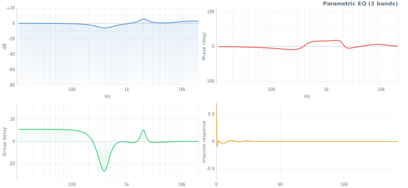

| band type | params | description |
|---|---|---|
| `'peak'` (default) | `fc`, `Q`, `gain` | bell-shaped boost/cut |
| `'lowshelf'` | `fc`, `Q`, `gain` | shelving below fc |
| `'highshelf'` | `fc`, `Q`, `gain` | shelving above fc |

```js
import { parametricEq } from 'audio-filter/eq'

parametricEq(buffer, {
  bands: [
    { fc: 80,   Q: 0.7, gain: +4,  type: 'lowshelf'  },
    { fc: 1000, Q: 2.0, gain: -3,  type: 'peak'      },
    { fc: 8000, Q: 0.7, gain: +2,  type: 'highshelf' },
  ],
  fs: 44100
})
```


### Crossover

*Linkwitz-Riley crossover network — splits audio into N frequency bands with flat magnitude sum.*

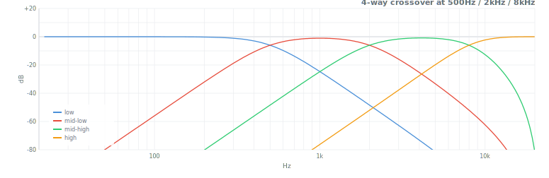

| param | default | description |
|---|---|---|
| `frequencies` | — | crossover frequencies (N−1 values for N bands) |
| `order` | 4 | LR order: 2, 4, or 8 |
| `fs` | 44100 | sample rate |

**Returns** `SOS[][]` — one SOS array per band.

```js
import { crossover } from 'audio-filter/eq'
import { filter } from 'digital-filter'

let bands = crossover([500, 5000], 4, 44100)   // 3 bands: lo / mid / hi

let lo  = Float64Array.from(buffer); filter(lo,  { coefs: bands[0] })
let mid = Float64Array.from(buffer); filter(mid, { coefs: bands[1] })
let hi  = Float64Array.from(buffer); filter(hi,  { coefs: bands[2] })
```

<details>
<summary>Reference</summary>

**Filter type**: Linkwitz-Riley — cascade of two Butterworth filters of half the specified order
**Property**: LR4 (order=4) bands sum to flat magnitude response with correct phase alignment
**Orders**: LR2 (−12 dB/oct), LR4 (−24 dB/oct, most common), LR8 (−48 dB/oct)
**Designers**: Siegfried Linkwitz & Russ Riley (1976), "Active Crossover Networks for Non-Coincident Drivers"
**Use when**: speaker system design, multi-band dynamics, band splitting for separate processing

</details>


### Crossfeed

*Headphone crossfeed — mixes a filtered copy of each channel into the other to reduce in-head localization.*

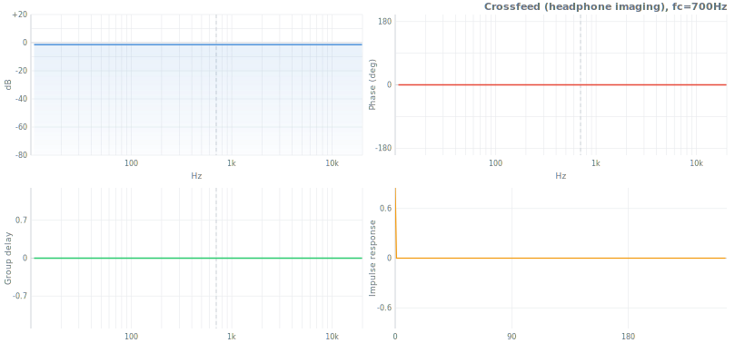

| param | default | description |
|---|---|---|
| `fc` | 700 | crossfeed lowpass cutoff (Hz) |
| `level` | 0.3 | mix amount 0–1 |
| `fs` | 44100 | sample rate |

Takes two separate channel buffers, modifies both in-place.

```js
import { crossfeed } from 'audio-filter/eq'

crossfeed(left, right, { fc: 700, level: 0.3, fs: 44100 })
```

<details>
<summary>Reference</summary>

**Problem**: speaker playback has inter-channel crosstalk and head shadowing. Headphones remove these, causing an unnatural "in-head" stereo image.
**Solution**: add a lowpass-filtered, attenuated copy of each channel to the opposite channel, simulating crosstalk and head diffraction.
**Reference**: Bauer (1961), "Stereophonic Earphones and Binaural Loudspeakers"; BS2B (Bauer Stereophonic-to-Binaural) algorithm
**fc**: models the head-shadow lowpass (~700 Hz is typical); **level**: 0.3 = mild, 0.5 = strong

</details>


## Effect

Signal processing utilities — conditioning, shaping, and analyzing audio signals.


### DC blocker

*Removes DC offset — the simplest useful filter.*

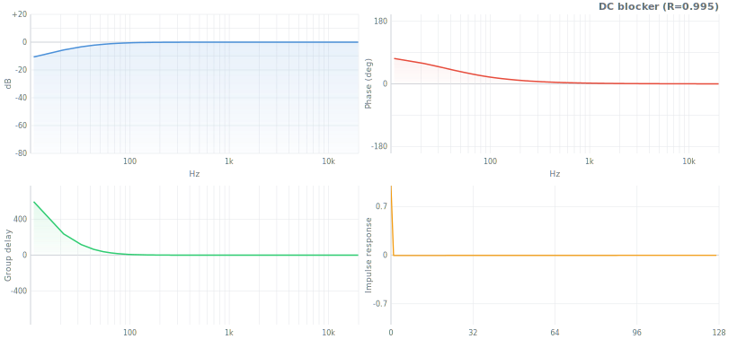

H(z) = (1 − z⁻¹) / (1 − R·z⁻¹)

| param | default | description |
|---|---|---|
| `R` | 0.995 | pole radius — closer to 1 = lower cutoff (~22 Hz at R=0.995, 44.1 kHz) |

```js
import { dcBlocker } from 'audio-filter/effect'

let params = { R: 0.995 }
dcBlocker(buffer, params)
```


### Comb filter

*Adds a delayed copy of the signal to itself — notches and peaks at harmonics of fs/delay.*

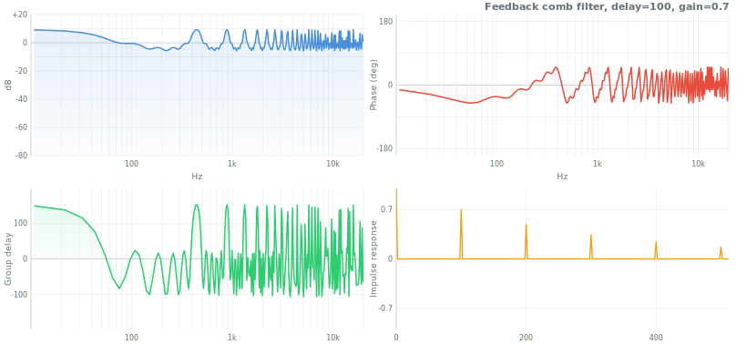

| param | default | description |
|---|---|---|
| `delay` | — | delay in samples |
| `gain` | 0.5 | feedback/feedforward gain |
| `type` | `'feedback'` | `'feedback'` or `'feedforward'` |

```js
import { comb } from 'audio-filter/effect'

comb(buffer, { delay: 100, gain: 0.6, type: 'feedback' })
```


### Allpass

*Unity magnitude at all frequencies — shifts phase only. First and second order.*

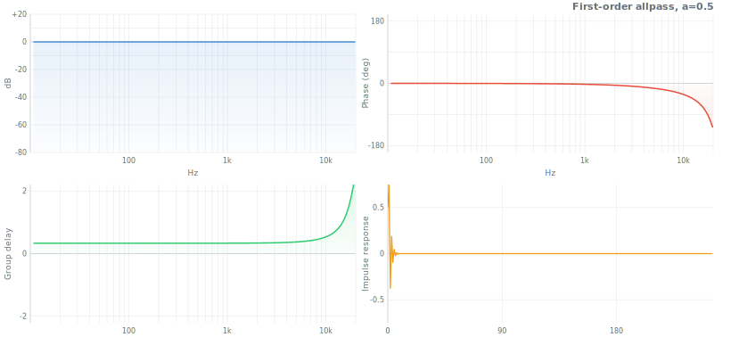

```js
import { allpass } from 'audio-filter/effect'

allpass.first(buffer, { a: 0.5 })                          // coefficient a
allpass.second(buffer, { fc: 1000, Q: 1, fs: 44100 })      // center fc, quality Q
```


### Pre-emphasis / de-emphasis

*First-order highpass (emphasis) and its inverse (de-emphasis) — used before and after coding or transmission.*

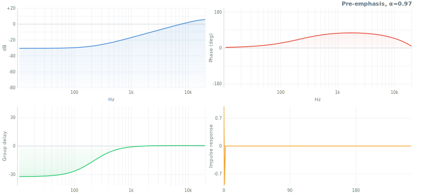

H(z) = 1 − α·z⁻¹ &nbsp;(emphasis) &nbsp;/&nbsp; 1/(1 − α·z⁻¹) &nbsp;(de-emphasis)

| param | default | description |
|---|---|---|
| `alpha` | 0.97 | coefficient (0 < α < 1) — higher = stronger high-frequency boost |

```js
import { emphasis, deemphasis } from 'audio-filter/effect'

emphasis(buffer, { alpha: 0.97 })    // before encoding
deemphasis(buffer, { alpha: 0.97 })  // after decoding — exact inverse
```


### Resonator

*Constant peak-gain bandpass — peak amplitude stays fixed regardless of bandwidth.*

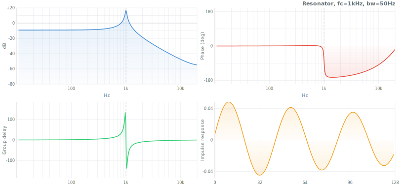

H(z) = (1 − R²) / (1 − 2R·cos(ω₀)·z⁻¹ + R²·z⁻²)

| param | default | description |
|---|---|---|
| `fc` | — | center frequency (Hz) |
| `bw` | 50 | bandwidth (Hz) — R = 1 − π·bw/fs |
| `fs` | 44100 | sample rate |

```js
import { resonator } from 'audio-filter/effect'

resonator(buffer, { fc: 440, bw: 20, fs: 44100 })
```

Unlike a peaking EQ section, peak gain is always 0 dB regardless of Q — stable for synthesis use.


### Envelope follower

*Tracks the instantaneous amplitude of a signal with configurable attack and release.*

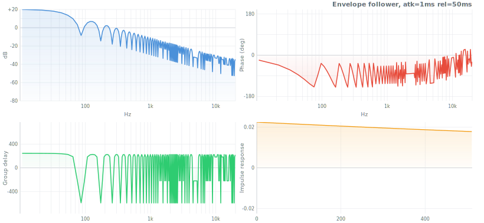

| param | default | description |
|---|---|---|
| `attack` | — | attack time (seconds) |
| `release` | — | release time (seconds) |
| `fs` | 44100 | sample rate |

```js
import { envelope } from 'audio-filter/effect'

let params = { attack: 0.001, release: 0.05, fs: 44100 }
envelope(buffer, params)   // buffer replaced with envelope signal (0–1)
```


### Slew limiter

*Limits the rate of change — asymmetric first-order lowpass with separate rise and fall rates.*

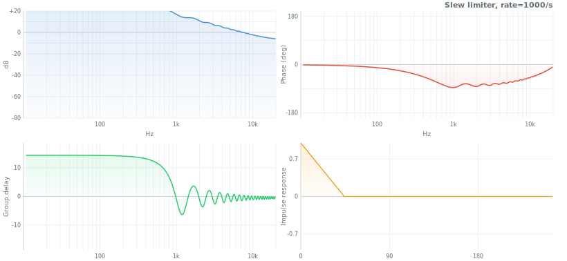

| param | default | description |
|---|---|---|
| `rise` | — | maximum rise rate (units/second) |
| `fall` | — | maximum fall rate (units/second) |
| `fs` | 44100 | sample rate |

```js
import { slewLimiter } from 'audio-filter/effect'

slewLimiter(buffer, { rise: 500, fall: 200, fs: 44100 })
```


### Noise shaping

*Error-feedback dithering — quantizes to N bits while pushing quantization noise into high frequencies.*

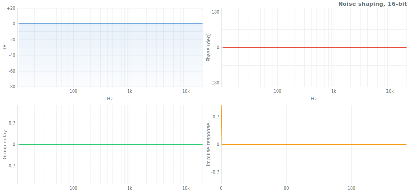

| param | default | description |
|---|---|---|
| `bits` | 16 | target bit depth |

```js
import { noiseShaping } from 'audio-filter/effect'

noiseShaping(buffer, { bits: 16 })   // dither to 16-bit, noise shaped above 10 kHz
```


### Pink noise

*Shapes white noise to 1/f spectrum — equal energy per octave.*

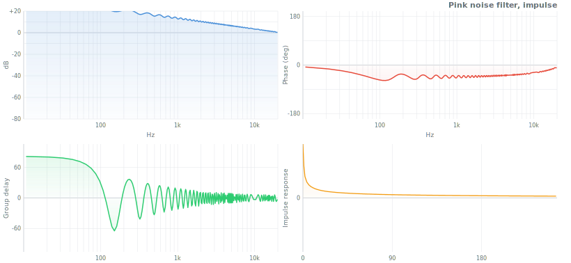

```js
import { pinkNoise } from 'audio-filter/effect'

let buf = new Float64Array(1024)
for (let i = 0; i < buf.length; i++) buf[i] = Math.random() * 2 - 1
pinkNoise(buf, {})   // white → pink (−3 dB/oct spectral slope)
```


### Spectral tilt

*Applies a constant dB/octave slope — tilts the entire spectrum.*

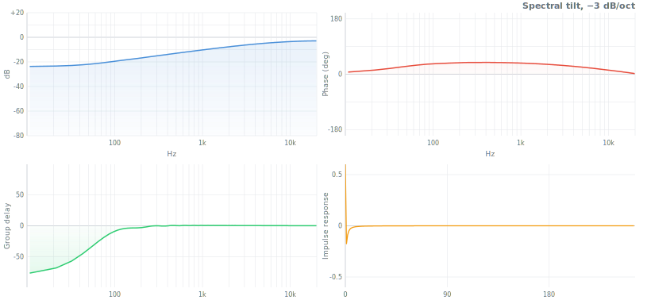

| param | default | description |
|---|---|---|
| `slope` | 0 | dB per octave (positive = boost highs, negative = boost lows) |
| `fs` | 44100 | sample rate |

```js
import { spectralTilt } from 'audio-filter/effect'

spectralTilt(buffer, { slope: -3, fs: 44100 })   // −3 dB/oct: brownian noise character
spectralTilt(buffer, { slope: +3, fs: 44100 })   // +3 dB/oct: pre-emphasis for coding
```


### Variable bandwidth

*Lowpass with continuously variable bandwidth — smooth parameter automation without discontinuities.*

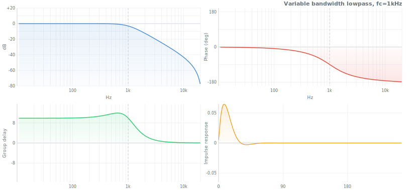

| param | default | description |
|---|---|---|
| `fc` | — | cutoff frequency (Hz) |
| `Q` | 0.707 | quality factor |
| `fs` | 44100 | sample rate |

```js
import { variableBandwidth } from 'audio-filter/effect'

variableBandwidth(buffer, { fc: 2000, Q: 1.0, fs: 44100 })
```


## Filter selection guide

| I need to... | Use |
|---|---|
| Measure SPL or noise level | `aWeighting` (general), `cWeighting` (peak), `itu468` (broadcast noise) |
| Measure loudness (LUFS/LU) | `kWeighting` |
| Decode vinyl audio | `riaa` |
| Model the cochlea / auditory system | `gammatone`, `erbBank` |
| Analyze a spectrum in octave bands | `octaveBank` |
| Psychoacoustic analysis / masking model | `barkBank` |
| Synth filter — warmth and resonance | `moogLadder` |
| Synth filter — acid / squelch | `diodeLadder` |
| Synth filter — 2-pole LP + HP | `korg35` |
| Synthesize vowel sounds | `formant` |
| Transfer one sound's spectral shape to another | `vocoder` |
| Studio EQ at fixed ISO frequencies | `graphicEq` |
| Studio EQ with full per-band control | `parametricEq` |
| Split audio for multi-way speakers | `crossover` |
| Improve headphone stereo imaging | `crossfeed` |
| Remove DC offset | `dcBlocker` |
| Create flanging / resonant combing | `comb` |
| Phase-shift without changing magnitude | `allpass.first`, `allpass.second` |
| Pre-process for audio coding | `emphasis` / `deemphasis` |
| Modal synthesis (bells, drums, rooms) | `resonator` |
| Track signal amplitude | `envelope` |
| Smooth a control signal | `slewLimiter` |
| Dither for bit-depth reduction | `noiseShaping` |
| Generate pink / brown noise | `pinkNoise` + `spectralTilt` |
| Tilt spectrum for tone shaping | `spectralTilt` |


## See also

- [digital-filter](https://github.com/audiojs/digital-filter) — general-purpose filter design: Butterworth, Chebyshev, Bessel, Elliptic, FIR, and more. The mathematical foundation this package builds on.
- [Web Audio API](https://developer.mozilla.org/en-US/docs/Web/API/Web_Audio_API) — browser built-in audio; basic biquad shapes only, requires `AudioContext`, no offline processing.
- Zavalishin (2012), *The Art of VA Filter Design* — the definitive reference for the analog models in this package.
- Zölzer (2011), *DAFX: Digital Audio Effects* — comprehensive textbook covering most filter types here.
- Patterson et al. (1992), *Complex sounds and auditory images* — gammatone filter origin.
